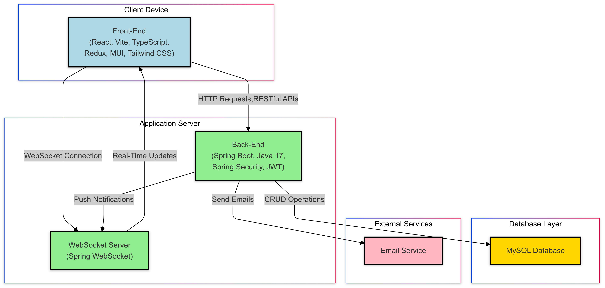
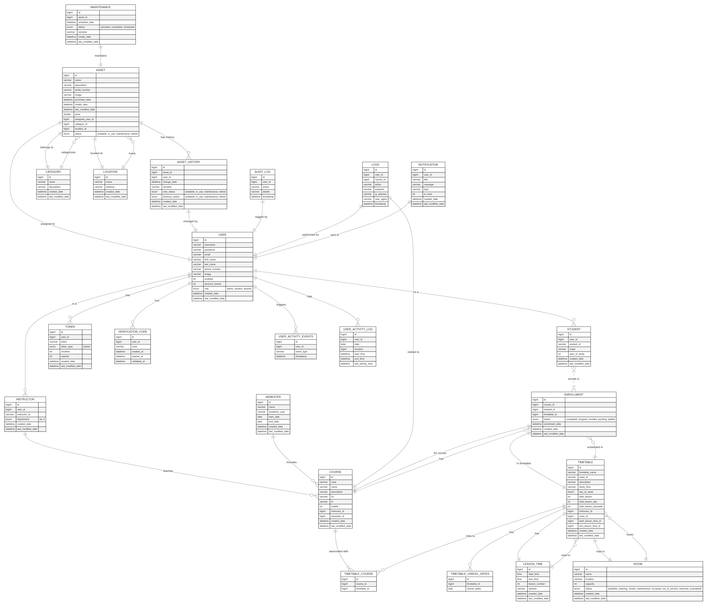

# 🧪 Lab Management System — Backend

<div align="center">


**Hệ thống quản lý phòng thực hành (Lab Management System)** — Backend RESTful API được xây dựng bằng Spring Boot 3, tích hợp bảo mật nâng cao, real-time WebSocket, observability stack ELK và containerization hoàn chỉnh với Docker.

[🌐 Frontend Repo](https://github.com/NgSang0127/lab_management_ui) · [📖 API Docs (Swagger)](#api-documentation) · [🐛 Báo lỗi](https://github.com/NgSang0127/lab_management_be/issues)

</div>

---

## 📋 Mục lục

- [Tổng quan dự án](#-tổng-quan-dự-án)
- [Kiến trúc hệ thống](#-kiến-trúc-hệ-thống)
- [ERD — Thiết kế cơ sở dữ liệu](#-erd--thiết-kế-cơ-sở-dữ-liệu)
- [Tính năng chính](#-tính-năng-chính)
- [Tech Stack](#-tech-stack)
- [Cấu trúc dự án](#-cấu-trúc-dự-án)
- [Yêu cầu hệ thống](#-yêu-cầu-hệ-thống)
- [Hướng dẫn cài đặt & chạy](#-hướng-dẫn-cài-đặt--chạy)
- [Biến môi trường](#-biến-môi-trường)
- [API Documentation](#-api-documentation)
- [Monitoring & Logging](#-monitoring--logging)
- [Đóng góp](#-đóng-góp)
- [Tác giả](#-tác-giả)
- [License](#-license)

---

## 🎯 Tổng quan dự án

**Lab Management System** là đề tài luận văn tốt nghiệp nhằm số hoá và tự động hoá toàn bộ quy trình quản lý phòng thực hành tại các trường đại học/cao đẳng. Hệ thống cho phép:

- **Admin / Giáo vụ** quản lý lịch sử dụng phòng, thiết bị, tài khoản người dùng.
- **Giảng viên** đăng ký mượn phòng, theo dõi lịch dạy và nhận thông báo real-time.
- **Sinh viên** tra cứu lịch học, tình trạng phòng và thiết bị.

Dự án được xây dựng theo kiến trúc **RESTful API** với đầy đủ bảo mật (JWT + 2FA), hệ thống log tập trung (ELK Stack), caching (Redis), và hỗ trợ export dữ liệu ra file Excel/CSV.

---

## 🏛️ Kiến trúc hệ thống



Hệ thống bao gồm các thành phần chính sau, tất cả được điều phối bởi Docker Compose:

| Thành phần | Vai trò |
|---|---|
| **Spring Boot App** | REST API server, business logic |
| **MySQL 8.0** | Cơ sở dữ liệu quan hệ chính |
| **Redis** | Caching, session/token storage |
| **Elasticsearch** | Full-text search & log storage |
| **Logstash** | Thu thập và xử lý log pipeline |
| **Kibana** | Dashboard trực quan hoá log |
| **Filebeat** | Shipper log từ ứng dụng sang Logstash |
| **MailDev** | SMTP server giả lập cho môi trường dev |
| **Vite/React Frontend** | UI client (container riêng) |

---

## 🗄️ ERD — Thiết kế cơ sở dữ liệu



Cơ sở dữ liệu được thiết kế chuẩn hoá với các nhóm entity chính:

- **User & Role**: Quản lý tài khoản, phân quyền RBAC.
- **Lab & Equipment**: Thông tin phòng thực hành và thiết bị.
- **Schedule / Booking**: Lịch đặt phòng và thời khoá biểu.
- **Notification**: Hệ thống thông báo real-time.
- **Audit Log**: Ghi lại lịch sử thao tác.

---

## ✨ Tính năng chính

### 🔐 Xác thực & Bảo mật
- Đăng ký / Đăng nhập bằng email + mật khẩu
- **JWT Access Token + Refresh Token** — tự động làm mới phiên
- **Two-Factor Authentication (2FA)** bằng Google Authenticator (TOTP)
- Xác minh email qua OTP (tích hợp JavaMailSender + Thymeleaf template)
- Phân quyền theo vai trò: `ADMIN`, `TEACHER`, `STUDENT`
- Spring Security 6 với cấu hình filter chain tùy chỉnh

### 📅 Quản lý lịch & Phòng thực hành
- CRUD phòng thực hành và thiết bị
- Đặt lịch / huỷ lịch sử dụng phòng
- Kiểm tra conflict lịch tự động
- Quản lý thời khoá biểu theo học kỳ

### 📡 Real-time Communication
- **WebSocket (STOMP)** — thông báo tức thì khi có thay đổi lịch, trạng thái phòng
- Spring Messaging + Spring Security Messaging

### 📊 Export dữ liệu
- Xuất báo cáo ra file **Excel (.xlsx)** bằng Apache POI
- Xuất dữ liệu ra file **CSV** bằng OpenCSV
- Import dữ liệu hàng loạt từ Excel/CSV

### 🗂️ Caching & Hiệu năng
- **Redis** cache cho các truy vấn thường xuyên (lịch, danh sách phòng)
- Giảm tải database đáng kể với chiến lược cache-aside

### 📈 Observability — Logging & Monitoring
- Tích hợp **ELK Stack** (Elasticsearch + Logstash + Kibana)
- **Filebeat** shipper log từ ứng dụng Spring Boot
- **Logstash Logback Encoder** — log cấu trúc JSON
- Xem và phân tích log tập trung trên **Kibana dashboard**

### 📖 API Documentation
- **Springdoc OpenAPI 3 + Swagger UI** — tài liệu API tự động sinh
- Có thể test API trực tiếp từ trình duyệt

---

## 🛠️ Tech Stack

### Backend Core
| Công nghệ | Phiên bản | Mục đích |
|---|---|---|
| Java | 17 (LTS) | Ngôn ngữ chính |
| Spring Boot | 3.3.9 | Framework ứng dụng |
| Spring Security | 6.x | Xác thực & Phân quyền |
| Spring Data JPA | 3.x | ORM & Database access |
| Spring WebSocket | 3.x | Real-time communication |
| Spring Mail | 3.x | Gửi email |

### Database & Cache
| Công nghệ | Phiên bản | Mục đích |
|---|---|---|
| MySQL | 8.0.38 | Cơ sở dữ liệu chính |
| Redis | Latest | Cache & Session |
| Spring Data Redis | 3.x | Redis integration |

### Security & Auth
| Thư viện | Phiên bản | Mục đích |
|---|---|---|
| JJWT | 0.11.5 | JSON Web Token |
| TOTP (samstevens) | 1.7.1 | 2FA / Google Authenticator |
| Thymeleaf | 3.x | Email template |

### Data Processing
| Thư viện | Phiên bản | Mục đích |
|---|---|---|
| Apache POI | 5.2.2 | Excel read/write |
| OpenCSV | 5.7.1 | CSV processing |
| Jackson Datatype JSR310 | 2.17.2 | Java 8 Date/Time serialization |

### Observability
| Công nghệ | Phiên bản | Mục đích |
|---|---|---|
| Elasticsearch | 8.16.5 | Log storage & search |
| Logstash | 8.16.5 | Log pipeline |
| Kibana | 8.16.5 | Log dashboard |
| Filebeat | 8.16.5 | Log shipper |
| Logstash Logback Encoder | 7.4 | Structured JSON logging |

### DevOps & Build
| Công nghệ | Mục đích |
|---|---|
| Docker + Docker Compose | Container orchestration |
| Maven | Build tool |
| Springdoc OpenAPI 2.6.0 | API documentation |
| Lombok | Boilerplate reduction |

---

## 📁 Cấu trúc dự án

```
lab_management_be/
├── src/
│   └── main/
│       ├── java/org/sang/LabManagement/
│       │   ├── config/          # Security, WebSocket, Redis, Mail config
│       │   ├── controller/      # REST Controllers (API endpoints)
│       │   ├── service/         # Business logic layer
│       │   ├── repository/      # JPA Repositories (Data access)
│       │   ├── entity/          # JPA Entities (Database models)
│       │   ├── dto/             # Data Transfer Objects
│       │   ├── security/        # JWT filter, UserDetails, Auth handlers
│       │   ├── exception/       # Global exception handling
│       │   └── util/            # Utility classes
│       └── resources/
│           ├── application.yml      # Main config
│           ├── application-dev.yml  # Dev profile config
│           ├── application-prod.yml # Prod profile config
│           └── templates/           # Thymeleaf email templates
├── filebeat/
│   └── filebeat.yml             # Filebeat shipper config
├── logstash/
│   ├── config/logstash.yml      # Logstash settings
│   └── pipeline/                # Logstash pipeline definitions
├── image/
│   ├── ERD.png                  # Database ERD diagram
│   └── Architecture.png         # System architecture diagram
├── Dockerfile                   # Multi-stage Docker build
├── docker-compose.yml           # Full stack orchestration
├── pom.xml                      # Maven dependencies
└── README.md
```

---

## 💻 Yêu cầu hệ thống

| Công cụ | Phiên bản tối thiểu |
|---|---|
| Java (JDK) | 17+ |
| Maven | 3.8+ |
| Docker | 20.10+ |
| Docker Compose | 2.x+ |
| Git | 2.x+ |

---

## 🚀 Hướng dẫn cài đặt & chạy

### 1. Clone repository

```bash
git clone https://github.com/NgSang0127/lab_management_be.git
cd lab_management_be
```

### 2. Chạy toàn bộ stack với Docker Compose (Khuyến nghị)

Cách này sẽ tự động khởi động tất cả services: MySQL, Redis, ELK Stack, MailDev và Spring Boot App.

```bash
docker compose up -d
```

Kiểm tra trạng thái các container:

```bash
docker compose ps
```

Xem log ứng dụng:

```bash
docker compose logs -f springboot-app
```

### 3. Chạy chỉ các dependencies (MySQL, Redis, ELK) và chạy app local

**Bước 3.1 — Khởi động infrastructure:**

```bash
docker compose up -d mysql redis elasticsearch logstash kibana filebeat mail-dev
```

**Bước 3.2 — Cấu hình `application-dev.yml`:**

```yaml
spring:
  datasource:
    url: jdbc:mysql://localhost:3308/lab_management
    username: sang
    password: your_password
  redis:
    host: localhost
    port: 6379
  mail:
    host: localhost
    port: 1025
```

**Bước 3.3 — Build và chạy ứng dụng:**

```bash
# Build
./mvnw clean package -DskipTests

# Chạy với profile dev
./mvnw spring-boot:run -Dspring-boot.run.profiles=dev
```

Hoặc:

```bash
java -jar -Dspring.profiles.active=dev target/LabManagement-0.0.1-SNAPSHOT.jar
```

### 4. Build Docker image thủ công

```bash
# Build image Spring Boot
docker build -t lab/lab:0.0.1-SNAPSHOT .

# Chạy toàn bộ stack
docker compose up -d
```

---

## 🌍 Biến môi trường

Các biến môi trường chính được cấu hình trong `Dockerfile` và `docker-compose.yml`:

| Biến | Mô tả | Giá trị mặc định |
|---|---|---|
| `ACTIVE_PROFILE` | Spring profile (`dev` hoặc `prod`) | `prod` |
| `DB_URL` | JDBC URL kết nối MySQL | `jdbc:mysql://mysql-lab:3306/lab_management` |
| `JAR_VERSION` | Phiên bản file JAR | `0.0.1-SNAPSHOT` |
| `EMAIL_HOSTNAME` | SMTP host | `smtp.gmail.com` |
| `EMAIL_USERNAME` | Địa chỉ email gửi | *(cấu hình trong .env)* |
| `EMAIL_PASSWORD` | App password Gmail | *(cấu hình trong .env)* |

> ⚠️ **Lưu ý bảo mật**: Không commit thông tin nhạy cảm (mật khẩu, secret key) lên Git. Sử dụng file `.env` hoặc biến môi trường hệ thống cho môi trường production.

---

## 📖 API Documentation

Sau khi ứng dụng khởi động, truy cập Swagger UI để xem và test toàn bộ API:

| Môi trường | URL |
|---|---|
| Local | http://localhost:8080/swagger-ui.html |
| Docker | http://localhost:8080/swagger-ui.html |

Swagger UI cung cấp:
- Danh sách đầy đủ các endpoints
- Mô tả request/response schema
- Khả năng test API trực tiếp từ trình duyệt (hỗ trợ JWT Bearer token)

---

## 📊 Monitoring & Logging

### Truy cập các dashboard

| Service | URL | Thông tin |
|---|---|---|
| **Kibana** | http://localhost:5601 | Log dashboard & analytics |
| **MailDev** | http://localhost:1080 | Xem email gửi đi (dev) |
| **Elasticsearch** | http://localhost:9200 | Raw log data |

### Luồng log (ELK Pipeline)

```
Spring Boot App → Log file (/logs/)
    → Filebeat (shipper)
        → Logstash (parse & transform)
            → Elasticsearch (store)
                → Kibana (visualize)
```

Log được ghi ra dưới dạng **JSON có cấu trúc** nhờ `logstash-logback-encoder`, giúp dễ dàng filter và query trên Kibana.

---

## 🌐 Danh sách Services & Ports

| Service | Container | Port (Host → Container) |
|---|---|---|
| Spring Boot API | `lab_management` | `8080 → 8080` |
| MySQL | `mysql-lab` | `3308 → 3306` |
| Redis | `redis_cache` | `6379 → 6379` |
| Elasticsearch | `elasticsearch` | `9200 → 9200` |
| Logstash | `logstash` | `5044 → 5044`, `9600 → 9600` |
| Kibana | `kibana` | `5601 → 5601` |
| MailDev SMTP | `mail-dev-lab` | `1025 → 1025` |
| MailDev UI | `mail-dev-lab` | `1080 → 1080` |
| Frontend (Vite) | `lab_management_ui` | `5173 → 80` |

---

## 🤝 Đóng góp

Dự án hiện là đề tài luận văn cá nhân. Nếu bạn muốn đóng góp ý kiến hoặc báo lỗi:

1. Fork repository
2. Tạo feature branch: `git checkout -b feature/ten-tinh-nang`
3. Commit thay đổi: `git commit -m 'feat: thêm tính năng X'`
4. Push branch: `git push origin feature/ten-tinh-nang`
5. Tạo Pull Request

---

## 👨‍💻 Tác giả

**NgSang0127**

- GitHub: [@NgSang0127](https://github.com/NgSang0127)

---

## 📜 License

Dự án được phân phối theo giấy phép **MIT**. Xem file [LICENSE](./LICENSE) để biết thêm chi tiết.

---

<div align="center">

Made with ❤️ as a Thesis Project

⭐ Nếu dự án này hữu ích, hãy cho một star để ủng hộ!

</div>
